# 👑 Pierre-Henry™ [@pH-7](https://github.com/pH-7?tab=repositories) 🤖

### 🎡 𝗣𝗮𝘀𝘀𝗶𝗼𝗻𝗮𝘁𝗲 Creative 𝗦𝗼𝗳𝘁𝘄𝗮𝗿𝗲 𝗘𝗻𝗴𝗶𝗻𝗲𝗲𝗿 💡

[][x-url]


#### 🧩 Happy Problem-Solving! 🤗

<details open><summary><ins><strong><em>Who Am I?</em></strong></ins></summary>
  Pierre-Henry, a super passionate **senior full-stack engineer** with skills in **Data Science**, **ML** and **AI**, building things that matter with real impact on the world! 🌏 I really enjoy taking care of others and managing my workflow based on productivity methodologies. I'm open to fast-paced changes with rapidly evolving business and technologies, always eager to learn and undertake exciting new challenges. For every project I commit to, I push a lot of focus, determination, energy, and knowledg to accomplish new projects or missions from scratch 😊

<!--
  [](https://ph7.me "Pierre-Henry Soria, Senior Software Engineer")
-->
</details>

<details><summary><ins><em>Further about me? 🤔</em></ins></summary>
  <p>👉 <strong><a href="https://pierrehenry.be">PierreHenry.BE</a></strong></p>
  <p>
    
  </p> 
</details>

<details><summary><ins><em>My Principle 🎂</em></ins></summary>
  <em>🧠 Never Stop Learning &amp; Researching! 🚀</em>
  
  ```mermaid
  journey
    title 🌞 My Daily Routine 🏆
    section Breakfast
      TypeScript: 5
    section Lunch
      React: 5
    section Dinner
      IntegrationTests: 5
  ```
</details>

<details><summary><ins><em>My Core Values 💥</em></ins></summary>

✅ **Enthusiastic and Highly Passionate** engineer.

✅ **Experience building complex and scalable applications**, online communities, SaaS and modern CMS from scratch.

✅ **Strong knowledge in design patterns** (GRASP, Factory, Strategy, Observer, DI, ADR, MVC, ...).

✅ **Clean Code, DRY and SOLID principles** are second nature to me.

✅ **Give lots of focus, perseverance, and knowledge** to accomplish new projects as best I can from scratch.

✅ **Passion for writing secure, testable, and scalable applications**, following the best coding practices.

✅ **Growth mindset**, I always tend to see mistakes as "learning experiences & continuous improvements" for myself, and those around me.

✅ **Love sharing** knowledge and helping others.

✅ **As a lifelong learner, learning is my core value**. Developing new skills on a daily basis is essential to me.

✅ **Working with Agile** methodologies such as Scrum and Kanban.

</details>

<details><summary><ins><em>What I'm doing? 💪</em></ins></summary>

✔️ Coding <a href="https://pierrehenry.be/realtime-github-activity.html" target="_blank" rel="noopener">exciting projects</a> 🥳

✔️ Writing interesting articles on <a href="https://pierrewriter.com">PierreWriter</a> 📝

✔️ Drinking coffees/teas ☕️ and eating vegetarian healthy food 🥕

✔️ Listening to informational Podcasts and Audible 🎧 while walking/hiking 🐾

✔️ Keeping myself up-to-date with the latest programming methodologies and concepts (thanks to amazing video courses I regularly purchase 🤗).

</details>

---

### 🎉 [My Latest Programming Videos](https://www.youtube.com/@pH7Programming/videos) 📺

- **[Tejas Kumar: Learning, AI, React 19, Tech Career Fulfillment...](https://www.youtube.com/watch?v=K3SR37pIzVs)**
<!-- YOUTUBE:START -->
- [AI code editor iterates by learning from received...](https://www.youtube.com/watch?v=eQyK9o_jy8Q)
- [How to be THE AI THINKER as a Software Engineer?](https://www.youtube.com/watch?v=iCA1Sqy4mCw)
- [I Let GitHub Copilot Take Over My Coding — Life of...](https://www.youtube.com/watch?v=mUSQt0LA4SI)
- [Building an App Live with Cursor AI – Watch the Ma...](https://www.youtube.com/watch?v=4a1IHkssrEc)
- [AI Code Editors: Trust but Verify - A Guide for So...](https://www.youtube.com/watch?v=8IrsgzobOLo)
- [WATCH This: Code Cleverly with AI Cursor](https://www.youtube.com/watch?v=4fWNA1OiT_o)
- [I Built a Full React Native App Using Only Cursor...](https://www.youtube.com/watch?v=iPyzbBFkbOY)
<!-- YOUTUBE:END -->


### 👋 Let's Connect! 🤗

[][linkedin-url]
[][x-url]
[][dev-url]
[][youtube-url]
[][author-url]


<!-- GitHub's Markdown reference links -->
[linkedin-url]: https://www.linkedin.com/in/ph7enry/
[x-url]: https://x.com/phenrysay
[dev-url]: https://dev.to/pierre/
[youtube-url]: https://www.youtube.com/channel/UCGqLuT0upPiocwYSnnmqt2g
[author-url]: https://pierrehenry.be
