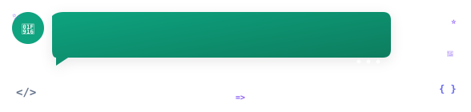

# 👑 Pierre-Henry™ @ [pH-7](https://github.com/pH-7?tab=repositories) 🤖

### 🎡 𝗣𝗮𝘀𝘀𝗶𝗼𝗻𝗮𝘁𝗲 Creative 𝗦𝗼𝗳𝘁𝘄𝗮𝗿𝗲 𝗘𝗻𝗴𝗶𝗻𝗲𝗲𝗿 💡

[][x-url]

#### 🧩 Happy Problem-Solving! 🤗

<details>
  <summary><ins><strong><em>Who Am I?</em></strong></ins></summary>

**[Pierre-Henry][author-url]**, a super passionate **Senior Full-Stack Engineer** with skills in **Data Science**, **ML**, and **AI**, building things that matter with real impact on the world! 🌏

I really enjoy taking care of others and managing my workflow based on productivity methodologies. I'm open to fast-paced changes in rapidly evolving business and technologies, always eager to learn and undertake exciting new challenges. For every project I commit to, I bring focus, determination, energy, and knowledge to accomplish new projects or missions from scratch 😊

  [](https://ph7.me "Pierre-Henry, Senior Software Engineer")

</details>

<details>
  <summary><ins><em>Further about me? 🤔</em></ins></summary>
  <p>👉 <strong><a href="https://pierrehenry.be">PierreHenry.BE</a></strong></p>
  <p>
    
  </p>
</details>

<details>
  <summary><ins><em>My Principle 🎂</em></ins></summary>
  <em>🧠 Never Stop Learning &amp; Researching! 🚀</em>

```mermaid
journey
  title "🌞 My Daily Routine 🏆"
  section "Breakfast"
    "TypeScript": 5
  section "Lunch"
    "React": 5
  section "Dinner"
    "IntegrationTests": 5
  ```
</details>

<details>
  <summary><ins><em>My Core Values 💥</em></ins></summary>

✅ **Own the outcome, not only the code.** I work from problem definition and trade-offs through architecture, implementation and production operation.

✅ **Treat correctness as a product requirement.** Testing, review, reliability and clear failure modes matter when software supports consequential decisions and real operations.

✅ **Prefer clear, maintainable systems.** I value simple boundaries, explicit decisions, readable code and solutions that fit the problem.

✅ **Use AI with engineering discipline.** Agents, MCP tools and reusable skills increase delivery speed, but their output still goes through design, testing and review.

✅ **Learn by building.** A programming language, a long-running open-source platform and ongoing AI and data work reflect how I deepen technical understanding.

✅ **Commit for the long term.** More than 11,000 open-source commits and products carried from idea to production show the value I place on follow-through.

✅ **Share what I learn.** Open source, four software-engineering courses with more than 225,000 combined enrolments, videos and writing are part of my engineering practice.

✅ **Take care of the people around the work.** I value honest communication, useful documentation, teaching and constructive technical review.

✅ **Stay curious.** Learning, researching and testing ideas in practice remain part of my daily routine.

</details>

<details>
  <summary><ins><em>What I'm doing? 💪</em></ins></summary>

✔️ Building and maintaining <a href="https://github.com/pH-7?tab=repositories&q=&type=source&sort=stargazers" target="_blank" rel="noopener">open-source projects</a>, including long-running <a href="https://github.com/pH7Software" target="_blank" rel="noopener">pH7Builder work</a> and new AI and data experiments 🥳

✔️ Recording practical <a href="https://www.youtube.com/@pH7Programming/videos">AI programming videos</a> and co-hosting a <a href="https://open.spotify.com/show/0Ut8GMYnIGyGHuh9UUg4S3">podcast about life and happiness</a> 📺🎙️

✔️ Writing on <a href="https://pierrewriter.com/">PierreWriter</a>, publishing technical ideas on <a href="https://substack.com/@pierrehenry">Substack</a> and sharing short lessons through <a href="https://dailylearninghabit.wordpress.com">Daily Learning Habit™</a> 📝

✔️ Learning new software-engineering, AI and data-science techniques through advanced courses, then testing them in real projects 🤗

✔️ Drinking oat flat whites ☕️, eating vegetarian food 🥕 and tracking meals with <a href="https://apps.apple.com/app/mealsnap-ai-food-log-tracker/id6475162854">MealSnap Diary Journal</a> 🥗

✔️ Listening to podcasts and Audible while walking or hiking 🐾

</details>

---

### 🎉 [My Latest Tech Videos](https://www.youtube.com/@pH7Programming/videos) 📺

- **[Narender Reddy on Building Better Software Inside Large Enterprises](https://www.youtube.com/watch?v=srtqr7VHvE4)**
- **[Roberto Capodieci on 40 Years of Hacking, Blockchain, and AI](https://www.youtube.com/watch?v=XHeMsXDyw2A)**
- [How This Indie Engineer Builds Evergreen Software That Lasts: Herman Martinus, Founder of BearBlog](https://www.youtube.com/watch?v=I1Iw5yKmR5U)
<!-- YOUTUBE:START -->
- [Hard Problems’ Aren’t Actually Hard: The Pygmalion Effect is the Problem](https://www.youtube.com/watch?v=vxo9J3Lpouw)
- [Why REST Beats GraphQL for PWAs #substack #shorts](https://www.youtube.com/shorts/wJiUbtOzEwE)
- [Continuous improvement and solving user pain](https://www.youtube.com/shorts/rj72NesEEoY)
- [Solve real user problems by questioning the workflow #substack #shorts](https://www.youtube.com/shorts/n6k8_7Fcz-Y)
- [Master One Tool to Multiply Your Impact #substack #shorts](https://www.youtube.com/shorts/R_la4wDfkkk)
- [Choose Tools Based on Fit, Not FOMO #substack #shorts](https://www.youtube.com/shorts/o7xj8qGOE04)
- [Why Software Engineers Keep Choosing Complex Solutions Without Realizing It](https://www.youtube.com/watch?v=Ce8YbHmofYY)
<!-- YOUTUBE:END -->
- [Tejas Kumar: Learning, AI, React 19, Tech Career Fulfillment...](https://www.youtube.com/watch?v=K3SR37pIzVs)


### 👋 Let's Connect! 🤗

[][linkedin-url]
[][youtube-url]
[][dev-url]
[][substack-url]
[][author-url]
<!-- [][x-url] -->

<!-- GitHub's Markdown reference links -->
[linkedin-url]: https://www.linkedin.com/in/ph7enry/
[x-url]: https://x.com/phenrysay
[dev-url]: https://dev.to/pierre/
[youtube-url]: https://www.youtube.com/channel/UCGqLuT0upPiocwYSnnmqt2g
[substack-url]: https://substack.com/@pierrehenry
[author-url]: https://pierrehenry.dev
