# 👑 Pierre-Henry™ [@pH-7](https://github.com/pH-7?tab=repositories) 🤖

### 🎡 𝗣𝗮𝘀𝘀𝗶𝗼𝗻𝗮𝘁𝗲 Creative 𝗦𝗼𝗳𝘁𝘄𝗮𝗿𝗲 𝗘𝗻𝗴𝗶𝗻𝗲𝗲𝗿 💡

[][x-url]

#### 🧩 Happy Problem-Solving! 🤗

<details open>
  <summary><ins><strong><em>Who Am I?</em></strong></ins></summary>

**[Pierre-Henry][author-url]**, a super passionate **Senior Full-Stack Engineer** with skills in **Data Science**, **ML**, and **AI**, building things that matter with real impact on the world! 🌏 

I really enjoy taking care of others and managing my workflow based on productivity methodologies. I'm open to fast-paced changes in rapidly evolving business and technologies, always eager to learn and undertake exciting new challenges. For every project I commit to, I bring focus, determination, energy, and knowledge to accomplish new projects or missions from scratch 😊
  
  <!--
    [](https://ph7.me "Pierre-Henry Soria, Senior Software Engineer")
  -->

</details>

<details>
  <summary><ins><em>Further about me? 🤔</em></ins></summary>
  <p>👉 <strong><a href="https://pierrehenry.be">PierreHenry.BE</a></strong></p>
  <p>
    
  </p> 
</details>

<details>
  <summary><ins><em>My Principle 🎂</em></ins></summary>
  <em>🧠 Never Stop Learning &amp; Researching! 🚀</em>

```mermaid
journey
  title "🌞 My Daily Routine 🏆"
  section "Breakfast"
    "TypeScript": 5
  section "Lunch"
    "React": 5
  section "Dinner"
    "IntegrationTests": 5
  ```
</details>

<details>
  <summary><ins><em>My Core Values 💥</em></ins></summary>

✅ **Enthusiastic and Highly Passionate** engineer.

✅ **Experience building complex and scalable applications**, online communities, SaaS and modern CMS from scratch.

✅ **Strong knowledge in design patterns** (GRASP, Factory, Strategy, Observer, DI, ADR, MVC, ...).

✅ **Clean Code, DRY and SOLID principles** are second nature to me.

✅ **Give lots of focus, perseverance, and knowledge** to accomplish new projects as best I can from scratch.

✅ **Passion for writing secure, testable, and scalable applications**, following the best coding practices.

✅ **Growth mindset**, I always tend to see mistakes as "learning experiences & continuous improvements" for myself, and those around me.

✅ **Love sharing** knowledge and helping others.

✅ **As a lifelong learner, learning is my core value**. Developing new skills on a daily basis is essential to me.

✅ **Working with Agile** methodologies such as Scrum and Kanban.

</details>

<details>
  <summary><ins><em>What I'm doing? 💪</em></ins></summary>

✔️ Building <a href="https://github.com/pH-7?tab=repositories&q=&type=source&sort=stargazers" target="_blank" rel="noopener">exciting projects</a> 🥳

✔️ Writing interesting articles on <a href="https://pierrewriter.com">PierreWriter</a> 📝

✔️ Drinking coffees/teas ☕️ and eating vegetarian healthy food 🥕

✔️ Listening to informational Podcasts and Audible 🎧 while walking/hiking 🐾

✔️ Keeping myself up-to-date with the latest programming methodologies and concepts (thanks to amazing video courses I regularly purchase 🤗).

</details>

---

### 🎉 [My Latest Programming Videos](https://www.youtube.com/@pH7Programming/videos) 📺

- **[Tejas Kumar: Learning, AI, React 19, Tech Career Fulfillment...](https://www.youtube.com/watch?v=K3SR37pIzVs)**
<!-- YOUTUBE:START -->
- [COMPLEXITY and HOURS SPENT as a SOFTWARE ENGINEER](https://www.youtube.com/watch?v=rahUdK8A0mg)
- [Why you AREN’T AS GOOD as you SHOULD BE? How to be a BETTER Software Engine...](https://www.youtube.com/watch?v=s85zrC5sskY)
- [Journey of a SOFTWARE ENGINEER Using CLAUDE CODE &lpar;This is Just AI PROMPT EN...](https://www.youtube.com/watch?v=nzUGFEQ9o4s)
- [What Engineers Miss When Using AI: The Context Problem](https://www.youtube.com/watch?v=pAr_RIlGQzI)
- [Why DB design is a make-or-break choice #substack #shorts](https://www.youtube.com/shorts/BRiUOGK4VSc)
- [DAY 6: Build an audience attention measurement smart tool for better market...](https://www.youtube.com/watch?v=ZgvjcaCnP4Q)
- [Know design to prompt AI better #substack #shorts](https://www.youtube.com/shorts/Zln0wJdKOCk)
- [Stop building unneeded features #substack #shorts](https://www.youtube.com/shorts/Q4bqPU3_CZA)
<!-- YOUTUBE:END -->


### 👋 Let's Connect! 🤗

[][linkedin-url]
[][x-url]
[][youtube-url]
[][dev-url]
[][substack-url]
[][author-url]


<!-- GitHub's Markdown reference links -->
[linkedin-url]: https://www.linkedin.com/in/ph7enry/
[x-url]: https://x.com/phenrysay
[dev-url]: https://dev.to/pierre/
[youtube-url]: https://www.youtube.com/channel/UCGqLuT0upPiocwYSnnmqt2g
[substack-url]: https://substack.com/@pierrehenry
[author-url]: https://pierrehenry.dev
